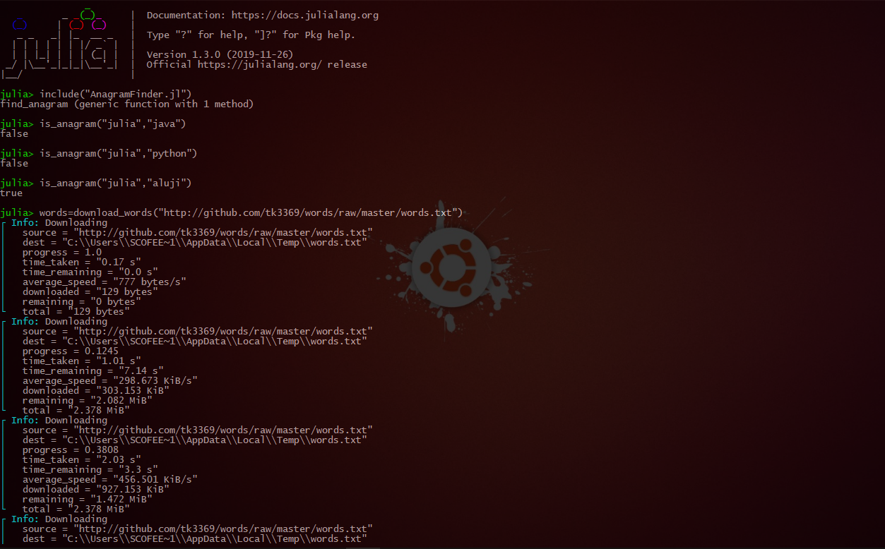
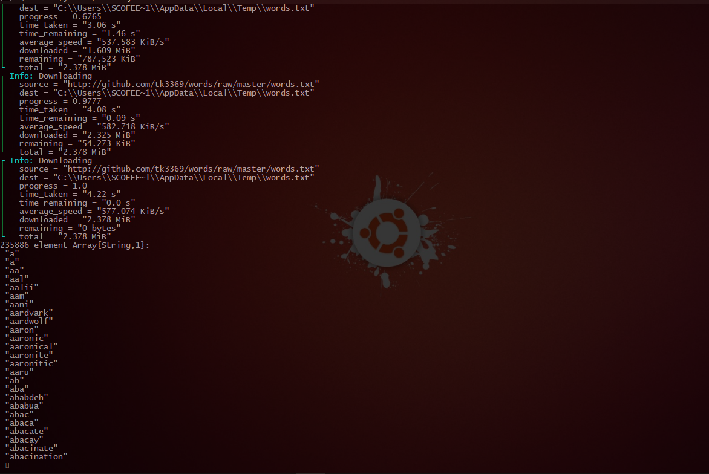

# AnagramFinder.jl
Anagram Search Script Written In Julia

# Screenshots




# This Script Has 3 Functions
1.`is_anagram()` Checks if two words are anagrams, if they're anagrams, it return true and false otherwise..

2.`download_words()` It download file containing list of words using the url you put

3.`find_anagram()` Finds related anagrams in the download file containing list of words

# Sample Run

```jl
julia> include("AnagramFinder.jl")
find_anagram (generic function with 1 method)

julia> is_anagram("julia","java")
false

julia> is_anagram("julia","python")
false

julia> is_anagram("julia","aluji")
true

julia> words=download_words("http://github.com/tk3369/words/raw/master/words.tx
┌ Info: Downloading
│   source = "http://github.com/tk3369/words/raw/master/words.txt"
│   dest = "C:\\Users\\SCOFEE~1\\AppData\\Local\\Temp\\words.txt"
│   progress = 1.0
│   time_taken = "0.17 s"
│   time_remaining = "0.0 s"
│   average_speed = "777 bytes/s"
│   downloaded = "129 bytes"
│   remaining = "0 bytes"
└   total = "129 bytes"
┌ Info: Downloading
│   source = "http://github.com/tk3369/words/raw/master/words.txt"
│   dest = "C:\\Users\\SCOFEE~1\\AppData\\Local\\Temp\\words.txt"
│   progress = 0.1245
│   time_taken = "1.01 s"
│   time_remaining = "7.14 s"
│   average_speed = "298.673 KiB/s"
│   downloaded = "303.153 KiB"
│   remaining = "2.082 MiB"
└   total = "2.378 MiB"
┌ Info: Downloading
│   source = "http://github.com/tk3369/words/raw/master/words.txt"
│   dest = "C:\\Users\\SCOFEE~1\\AppData\\Local\\Temp\\words.txt"
│   progress = 0.3808
│   time_taken = "2.03 s"
│   time_remaining = "3.3 s"
│   average_speed = "456.501 KiB/s"
│   downloaded = "927.153 KiB"
│   remaining = "1.472 MiB"
└   total = "2.378 MiB"
┌ Info: Downloading
│   source = "http://github.com/tk3369/words/raw/master/words.txt"
│   dest = "C:\\Users\\SCOFEE~1\\AppData\\Local\\Temp\\words.txt"
│   progress = 0.6765
│   time_taken = "3.06 s"
│   time_remaining = "1.46 s"
│   average_speed = "537.583 KiB/s"
│   downloaded = "1.609 MiB"
│   remaining = "787.523 KiB"
└   total = "2.378 MiB"
┌ Info: Downloading
│   source = "http://github.com/tk3369/words/raw/master/words.txt"
│   dest = "C:\\Users\\SCOFEE~1\\AppData\\Local\\Temp\\words.txt"
│   progress = 0.9777
│   time_taken = "4.08 s"
│   time_remaining = "0.09 s"
│   average_speed = "582.718 KiB/s"
│   downloaded = "2.325 MiB"
│   remaining = "54.273 KiB"
└   total = "2.378 MiB"
┌ Info: Downloading
│   source = "http://github.com/tk3369/words/raw/master/words.txt"
│   dest = "C:\\Users\\SCOFEE~1\\AppData\\Local\\Temp\\words.txt"
│   progress = 1.0
│   time_taken = "4.22 s"
│   time_remaining = "0.0 s"
│   average_speed = "577.074 KiB/s"
│   downloaded = "2.378 MiB"
│   remaining = "0 bytes"
└   total = "2.378 MiB"
235886-element Array{String,1}:
 "a"
 "a"
 "aa"
 "aal"
 "aalii"
 "aam"
 "aani"
 "aardvark"
 "aardwolf"
 "aaron"
 "aaronic"
 "aaronical"
 "aaronite"
 "aaronitic"
 "aaru"
 "ab"
 "aba"
 "ababdeh"
 "ababua"
 "abac"
 "abaca"
 "abacate"
 "abacay"
 "abacinate"
 "abacination"
 ⋮
 "zymophosphate"
 "zymophyte"
 "zymoplastic"
 "zymoscope"
 "zymosimeter"
 "zymosis"
 "zymosterol"
 "zymosthenic"
 "zymotechnic"
 "zymotechnical"
 "zymotechnics"
 "zymotechny"
 "zymotic"
 "zymotically"
 "zymotize"
 "zymotoxic"
 "zymurgy"
 "zyrenian"
 "zyrian"
 "zyryan"
 "zythem"
 "zythia"
 "zythum"
 "zyzomys"
 "zyzzogeton"

julia> find_anagram("cinema",words)
3-element Array{String,1}:
 "anemic"
 "cinema"
 "iceman"

julia>
```

# Feel Free To Checkout The Script and Give Feedback

